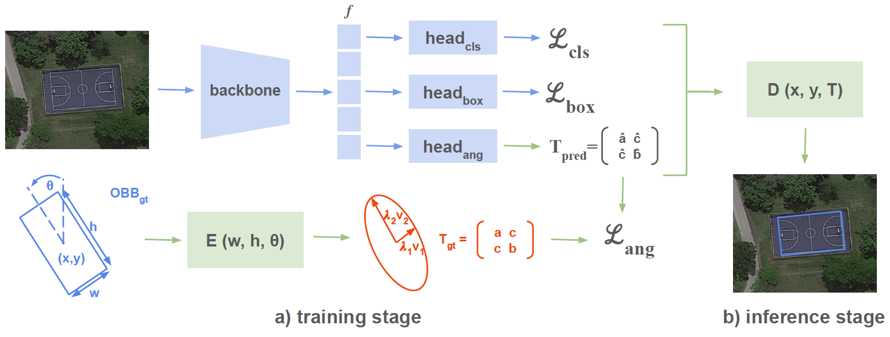

# Structure Tensor Representation for Robust Oriented Object Detection

[Xavier Bou](https://xavibou.github.io/), [Gabriele Facciolo](http://gfacciol.github.io/), [Rafael Grompone](https://scholar.google.fr/citations?user=GLovf4UAAAAJ&hl=en), [Jean-Michel Morel](https://sites.google.com/site/jeanmichelmorelcmlaenscachan/), [Thibaud Ehret](https://tehret.github.io)

Centre Borelli, ENS Paris-Saclay
---

[](https://arxiv.org/abs/2411.10497)
[](https://drive.google.com/drive/folders/1AnMQrW5UsMA6Hx-PM78iOnCPAzmgzPy3?usp=sharing)
[]()

This repository is the official implementation of the paper [Structure Tensor Representation for Robust Oriented Object Detection](https://arxiv.org/abs/2411.10497).


<video width="640" height="360" controls>
  <source src="./results_clip.mp4" type="video/mp4">
  Your browser does not support the video tag.
</video>


---


Oriented object detection predicts orientation in addition to object location and bounding box. Precisely predicting orientation remains challenging due to angular periodicity, which introduces boundary discontinuity issues and symmetry ambiguities. Inspired by classical works on edge and corner detection, this paper proposes to represent orientation in oriented bounding boxes as a structure tensor. This representation combines the strengths of Gaussian-based methods and angle-coder solutions, providing a simple yet efficient approach that is robust to angular periodicity issues without additional hyperparameters. Extensive evaluations across five datasets demonstrate that the proposed structure tensor representation outperforms previous methods in both fully-supervised and weakly supervised tasks, achieving high precision in angular prediction with minimal computational overhead. Thus, this work establishes structure tensors as a robust and modular alternative for encoding orientation in oriented object detection. We make our code publicly available, allowing for seamless integration into existing object detectors.



## 🛠️ Usage

More instructions on installation, pretrained models, training and evaluation, please refer to [MMRotate 0.3.4](README_en.md).
  
- Clone this repo:

  ```bash
  git clone https://github.com/yangxue0827/RSG-MMRotate
  cd str_tensor_obb/
  ```

- Create a conda virtual environment and activate it:
  
  ```bash
  conda create -n str_tensor_obb python=3.8 -y
  conda activate str_tensor_obb
  ```

- Install Pytorch:

  ```bash
  pip install torch==1.13.1+cu117 torchvision==0.14.1+cu117 torchaudio==0.13.1 --extra-index-url https://download.pytorch.org/whl/cu117
  ```

- Install requirements:

  ```bash
  pip install openmim
  mim install mmcv-full
  mim install mmdet
  
  cd mmrotate
  pip install -r requirements/build.txt
  pip install -v -e .

  pip install timm
  pip install ipdb
  ```

## 🚀 Released Models

We provide several configs and pre-trained models using the Structure Tensor (ST) representation:

|  Detector  | Dataset | Configs | Download |
| :--------: |:---:|:-------:|:--------:|
| FCOS w/ ResnNet-50 (ST) | DOTA| [rotated_fcos_str_tensor_r50_fpn_1x_dota_le90](configs/psc/rotated_fcos_str_tensor_r50_fpn_1x_dota_le90.py) | [ckpt](https://drive.google.com/file/d/1wZP3R4JpmcEoazwrX5xgSI9Gamo13DZA/view?usp=sharing) 
| H2RBox-v2 ResnNet-50 (ST) | DOTA| [h2rbox_v2p_r50_fpn_1x_dota_le90_str_tensor](configs/h2rbox_v2p/h2rbox_v2p_r50_fpn_1x_dota_le90_str_tensor.py) | [ckpt](https://drive.google.com/file/d/1CbufttHmlFZPFTzJNc4_vCo5oNl4pa75/view?usp=sharing) 
| FCOS w/ ResnNet-50 (ST) | HRSC2016| [rotated_fcos_str_tensor_r50_fpn_6x_hrsc_le90](configs/psc/rotated_fcos_str_tensor_r50_fpn_6x_hrsc_le90.py) | [ckpt](https://drive.google.com/file/d/1THPNap0P9huiSan3d26QdTHUOyCZ6hVu/view?usp=sharing) 
| H2RBox-v2 ResnNet-50 (ST) | HRSC2016| [h2rbox_v2p_r50_fpn_6x_hrsc_le90_str_tensor](configs/h2rbox_v2p/h2rbox_v2p_r50_fpn_6x_hrsc_le90_str_tensor.py) | [ckpt](https://drive.google.com/file/d/1WBoZkG7_iUb6LVmwZPLDiDmcXAoAOwXi/view?usp=sharing) 
| FCOS w/ ResnNet-50 (ST) | ICDAR15| [rotated_fcos_str_tensor_r50_fpn_6x_icdar15_le90](configs/psc/rotated_fcos_str_tensor_r50_fpn_6x_icdar15_le90.py)   |
| H2RBox-v2 ResnNet-50 (ST) | ICDAR15| [h2rbox_v2p_r50_fpn_6x_icdar_le90_str_tensor](configs/psc/h2rbox_v2p_r50_fpn_6x_icdar_le90_str_tensor.py) | 
| H2RBox-v2 ResnNet-50 (ST) | MSRA-TD500| [rotated_fcos_str_tensor_r50_fpn_6x_msra_le90](configs/h2rbox_v2p/rotated_fcos_str_tensor_r50_fpn_6x_msra_le90.py)   |
| H2RBox-v2 ResnNet-50 (ST) | MSRA-TD500| [h2rbox_v2p_r50_fpn_6x_msra_le90_str_tensor](configs/h2rbox_v2p/h2rbox_v2p_r50_fpn_6x_msra_le90_str_tensor.py)  |


## 🖊️ Citation

If you find this work helpful for your research, please consider giving this repo a star ⭐ and citing our paper:

```bibtex
@article{bou2024st,
  title={Structure Tensor Representation for Robust Oriented Object Detection}, 
  author={Xavier Bou and Gabriele Facciolo and Rafael Grompone von Gioi and Jean-Michel Morel and Thibaud Ehret},
  journal={arXiv preprint arXiv:},
  year={2024}
}
```

## 📃 License

This project is released under the [Apache license](LICENSE). Parts of this project contain code and models from other sources, which are subject to their respective licenses.

This repository is heavily borrowed from the MMRotate framework. For more details, see:  
**STAR: A First-Ever Dataset and A Large-Scale Benchmark for Scene Graph Generation in Large-Size Satellite Imagery.**
